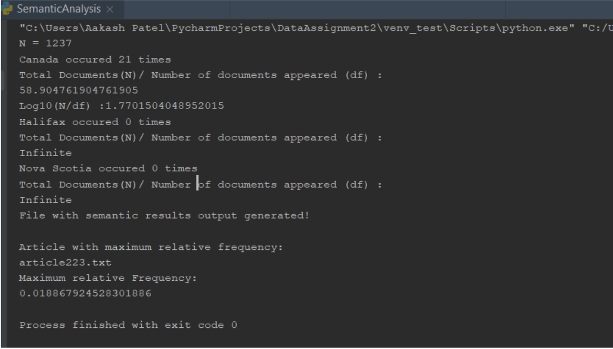
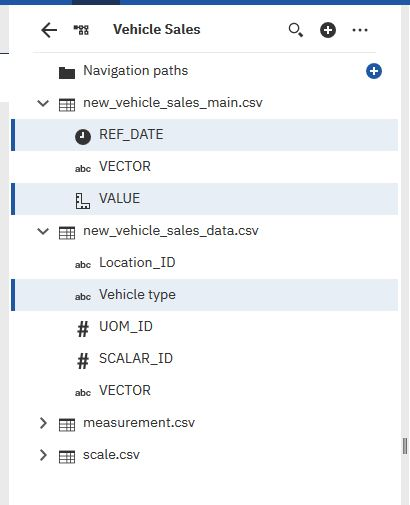
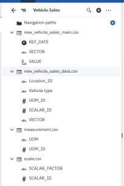
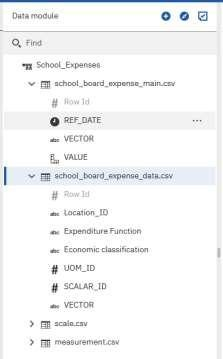
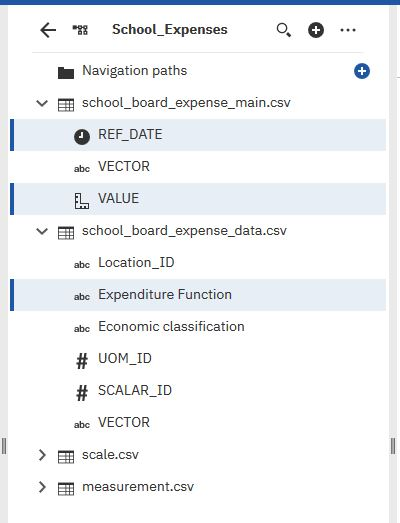
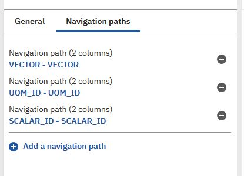
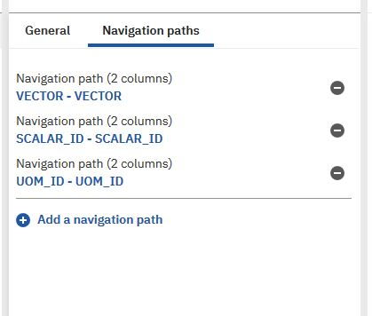

# BI-Data-Analytics
 
### A. Sentiment Analysis

- To perform sentiment analysis, I loaded my file with tweets of previous
assignment (retrieved from Twitter using Search API).

- I performed required cleaning to remove URL and any special characters. I did
consider Comma, Apostrophe and Space for not to be removed. They are not
removed since they make sense for tweet interpretation and have major impact
on twitter interpretability on removal.

- I processed each tweet in sequence and generated its bag of words.

- Bag of words represent count of each word’s occurrence.

- Each word of the Bag of words is then looked for if it contains positive and
negative words. Positive and Negative words to be compared with, are in lists
prepared from positive and negative word list standard defined by the online
source [1].

- If the tweet contains more positive words then Polarity is marked positive, more
count of negative words then marked Negative and Neutral if both counts are
equal. Results CSV File with Matches and Polarity is generated for every tweet.

### B. Semantic Analysis

1. To perform semantic analysis, I firstly determined N (i.e Number of total
documents) programmatically and then iterated through all the required words to
be assessed. For every word all articles created as part of second assignment, are
evaluated for count.

2. The content of the article is cleaned for URLs and special symbols (if any).

3. Count is then used to evaluate two other measures provided its non-zero.

4. As part of the second half of the script all articles are re-iterated to find total number of occurrences for word “Canada”(f) within the article , total word count of the article and its relative frequency (f/m). All this information is stored in newly generated CSV file (“semantic_results.csv”) and article with maximum relative frequency is displayed in
console.

**Figure 1: Semantic Analysis Script Output**

### C. Business Intelligence:

1. Firstly I did Cognos BI tool setup as guided by Lab session material. I created data
modules using tables imported. Here I bifurcated data for Vehicle and School for better
understanding and ease at further procedures.
Following facts were analysed:
- Number of vehicle sales
- School Board Expenses yearly

For Vehicle Sales data, the fact is number of vehicle sales sold whereas for School Board
data, the school board yearly values happens to be the fact.
Below dimensions were used for Vehicular data:
- New Vehicle Sales Main – It defines main value for vehicle Sale fact
- Measurement – It defines measurement parameter taken into consideration.
- Scale – It defines Scale for the measurement.

Below dimensions were used for School data:

- School Board Expense Main – It defines main value for school expense fact.
- Measurement – It defines measurement parameter taken into consideration.
- Scale – It defines Scale for the measurement.

Following are the fact and dimension tables taken into consideration:

**Figure 1: Vehicle Sales Data Fact Table**

**Figure 2: Vehicle Sales Dimension Tables (with all attributes)**

**Figure 3: School Board Expense Data Fact Table**

**Figure 4: School Expenses Dimensions Table (with all attributes)**

Navigation Paths hierarchies:

**Figure 5: Navigation Path hierachy for School**

**Figure 6 Navigation Path Attribute hierarchy of Vehicular Data**

### Data Warehouse design schemas:

**Figure 7: Vehicle Warehouse star schema**

**Figure 8: School Warehouse star schema**

### Cognos BI reports:

**Figure 9: Vehicle Yearly Sales for various Vehicle types**

**Figure 10: School Board Yearly Expenses for different expenditure functions**

- Using the BI framework following questions can be answered:

- Is there growth in motor vehicle sales?
o Motor Vehicle sales have increased considerably from 2010 to 2018.

- Is there growth for expenditure amount of school boards?
o School Board expenses have increased overall from 1973 to 2016.

Note: Second question is in accordance to the data available.

### References
[1] "shekhargulati/sentiment-analysis-python", GitHub, 2019. [Online]. Available:
https://github.com/shekhargulati/sentiment-analysis-python/blob/master/opinionlexicon-
English/. [Accessed: 19- Jul- 2019].

[2] Us1.ca.analytics.ibm.com, 2019. [Online]. Available:
https://us1.ca.analytics.ibm.com/bi/?perspective=camodeller&
id=1105780077_392f3e37dfdd4b2d9517e68fe2f4542d_sessionTemp&ui_app
bar=true&tid=1105780077_392f3e37dfdd4b2d9517e68fe2f4542d_sessionTemp.
[Accessed: 22- Jul- 2019].

[3]H. Python et al., "How to remove any URL within a string in Python", Stack Overflow,
2019. [Online]. Available: https://stackoverflow.com/questions/11331982/how-toremove-
any-urlwithin- a-string-in-python?noredirect=1&lq=1. [Accessed: 22- Jul- 2019].

[4] H. Python et al., "How to remove any URL within a string in Python", Stack Overflow,
2019. [Online]. Available: https://stackoverflow.com/questions/11331982/how-toremove-
any-urlwithin- a-string-in-python?noredirect=1&lq=1. [Accessed: 22- Jul- 2019].